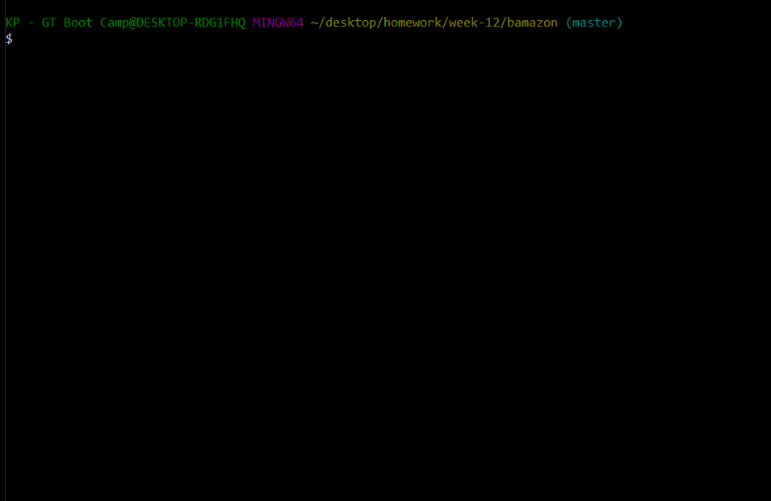
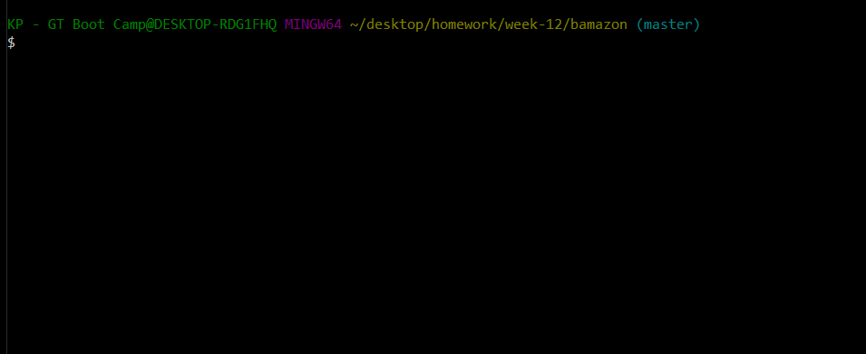
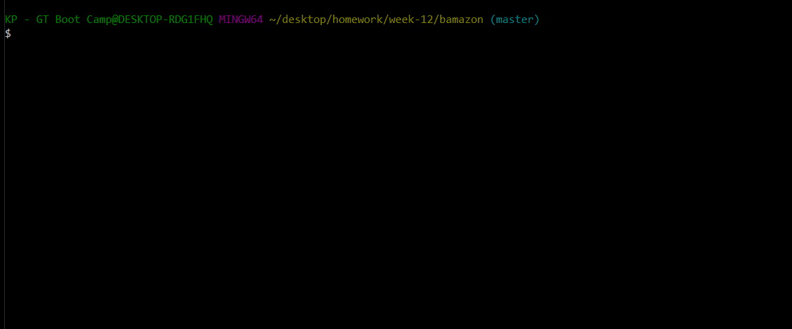
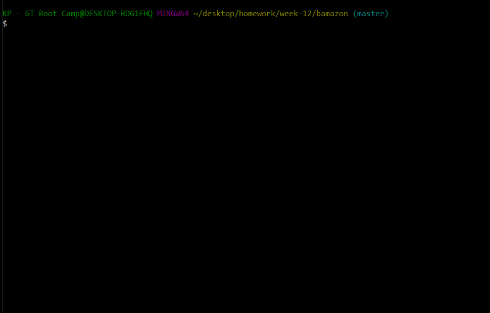

# Bamazon

## Introduction
Welcome to Bamazon, which is an Amazon-like storefront built using Node.js and MySQL.  This application gives the users the ability to place orders and also allows Bamazon managers to update their inventoy as well as add new products.

## Get Started
- Clone this repository.
- Navigate to your Terminal or Gitbash and run "npm install".
- Run the command lines below to access either the Customer or Manager view:
   * Customer View -  `node bamazoncustomer.js`
   * Manager View -  `node bamazonmanager.js`
- Run "Ctrl + C" to exit each mode.

## See What Each Command Line Does

### 1)  `bamazoncustomer.js`

   * Displays all products that are for sale.
   * Inquirer Prompts:
      * Enter the product ID for purchase.
      * Confirm if the product chosen is correct.
      * Enter the quantity needed.
         * If the quantity entered is available for purchase, the user will be given total sales amount.
         * If the quantity entered is unavailable for purchase, the user will be asked to enter a lesser amount to continue with the order.
   * When the order is completed, the stock quantity and product sales will be updated to reflect the purchase.

### 2) `bamazonmanager.js`

   * Displays a menu with four options:
      * `View Products for Sale`
      * `View Low Inventory`
      * `Add to Inventory`
      * `Add New Product`

   * When the user selects `View Products for Sale`, the app lists all of the products for sale including their details.

   

   * When the user selects `View Low Inventory`, the app lists all of the products which have less than 5 units in stock.

   

   * When the user selects `Add to Inventory`, the app allows the manager to select the product by ID and add more units to their inventory.

   

   * When the user selects `Add New Product`, the app allows to manager to add a new product with details such as department, price, and quantity.

   

## Technologies used
- Node.js
- MySQL
- NPM Packages
   - Inquirer
   - CLI Table
   - Chalk
